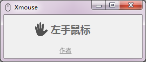
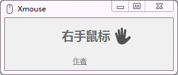

# Xmouse
 方便的切换鼠标左右键，因为功能非常简单，所以支持.net framework 2.0及以上 windows环境就可以了，目前已测试win7可用，反正我一直在用了。

 关于为什么做这么个东西，那是因为我右手疼，目前只能用左手鼠标好多年，不是左撇子（囧)，所以这个东西只对极少部分人有用，如果经常切换左右手，那就非常好用（哈哈)。
 
 产品目录结构如下：
 只有一个Xmouse.exe 和2个箭头相反的鼠标文件格式，2个鼠标文件是非必须选项，左手鼠标箭头就朝右上角，右手反之。
 
 

# 使用方法
- 1、运行Xmouse.exe，程序就会判断鼠标的左右手设置，如果是右手那么自动切换到左手。

- 2、如果是系统设置是左手则自动设置为右手。

- 3、点击文字左右侧的小手也可以实时切换左右手。

# 技术
- 开发工具 `visual studio 2017 RC版本` 马上换正式版本
- markdown 工具 `visual studio code` 真心好用
- .net 版本 `2.0`
- 调用组件 `user32.dll`
- 代码管理 `git`

# 下载
不用自己编译就直接点击 [下载](screenshot/Xmouse.rar) 吧
# 关于作者
不会写代码的产品经理不是好售前。个人博客 [jqpress.com](http://www.jqpress.com)，微信联系：robotbird798
